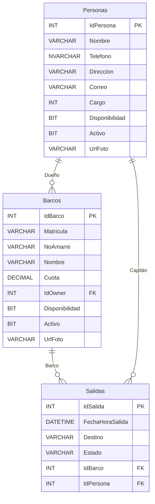

```mermaid
classDiagram
    %% CLASES EXTERNAS
    class SqlConnection
    class SqlCommand
    class Form

    %% ENTIDADES (VO)
    class VOPersona {
        +int IdPersona
        +string Nombre
        +string Telefono
        +string Direccion
        +string Correo
        +int? Cargo
        +bool? Disponibilidad
        +bool? Activo
        +string UrlFoto
        +VOPersona()
    }
    
    class VOBarco {
        +int IdBarco
        +string Matricula
        +string NoAmarre
        +string Nombre
        +double? Cuota
        +int? IdPersona
        +bool? Disponibilidad
        +bool? Activo
        +string UrlFoto
        +VOBarco()
    }
    
    class VOSalida {
        +int IdSalida
        +DateTime FechaHoraSalida
        +string Destino
        +string Estado
        +int IdBarco
        +int IdCapitan
        +VOSalida()
    }
    
    class VOSalidaExtendida {
        +string NombreCapitan
        +string UrlFotoCapitan
        +string NombreBarco
        +string UrlFotoBarco
        +VOSalidaExtendida()
    }
    
    %% HERENCIA
    VOSalidaExtendida --|> VOSalida
    FRM_AltaBarco --|> Form
    FRM_AltaPersona --|> Form
    FRM_AltaSalida --|> Form
    FRM_EditarBarco --|> Form
    FRM_EditarPersona --|> Form
    FRM_ListaBarcos --|> Form
    FRM_ListaPersonas --|> Form
    FRM_ListaSalidas --|> Form
    FrmPrincipal --|> Form
    
    %% RELACIONES ENTRE ENTIDADES (A partir de sus atributos FK)
    VOBarco --> VOPersona : Dueño (IdPersona)
    VOSalida --> VOBarco : Barco (IdBarco)
    VOSalida --> VOPersona : Capitán (IdCapitan)
    
    %% BLL
    class BLLPersona {
        +InsertarAsync(VOPersona persona)$ Task
        +ActualizarAsync(VOPersona persona)$ Task
        +EliminarAsync(int idPersona)$ Task
        +ConsultarPorIdAsync(int idPersona)$ Task~VOPersona~
        +ConsultarTodasAsync(bool? disponibilidad = null)$ Task~IEnumerable~VOPersona~~
        +ConsultarPorCargoAsync(int cargo, bool? disponibilidad = null)$ Task~IEnumerable~VOPersona~~
    }
    
    class BLLBarco {
        +InsertarAsync(VOBarco barco)$ Task~bool~
        +ActualizarAsync(VOBarco barco)$ Task~bool~
        +EliminarAsync(int idBarco)$ Task~bool~
        +ConsultarTodosAsync(bool? disponibilidad = null)$ Task~IEnumerable~VOBarco~~
        +ConsultarPorIdAsync(int idBarco)$ Task~VOBarco~
    }
    
    class BLLSalida {
        +InsertarAsync(VOSalida salida)$ Task~bool~
        +FinalizarAsync(int idSalida)$ Task~bool~
        +EliminarAsync(int idSalida)$ Task~bool~
        +ConsultarPorEstadoAsync(string estado = null)$ Task~IEnumerable~VOSalidaExtendida~~
        +ConsultarPorIdAsync(int idSalida)$ Task~VOSalidaExtendida~
    }
    
    %% DAL
    class DALPersona {
        +InsertarAsync(VOPersona persona)$ Task
        +ActualizarAsync(VOPersona persona)$ Task
        +EliminarAsync(int idPersona)$ Task
        +ConsultarPorIdAsync(int idPersona)$ Task~VOPersona~
        +ConsultarTodasAsync(bool? disponibilidad = null)$ Task~IEnumerable~VOPersona~~
        +ConsultarPorCargoAsync(int cargo, bool? disponibilidad = null)$ Task~IEnumerable~VOPersona~~
    }
    
    class DALBarco {
        +InsertarAsync(VOBarco barco)$ Task~bool~
        +ActualizarAsync(VOBarco barco)$ Task~bool~
        +EliminarAsync(int idBarco)$ Task~bool~
        +ConsultarTodosAsync(bool? disponibilidad = null)$ Task~IEnumerable~VOBarco~~
        +ConsultarPorIdAsync(int idBarco)$ Task~VOBarco~
    }
    
    class DALSalida {
        +InsertarAsync(VOSalida salida)$ Task~bool~
        +FinalizarAsync(int idSalida, string estado = "Terminada")$ Task~bool~
        +EliminarAsync(int idSalida)$ Task~bool~
        +ConsultarPorEstadoAsync(string estado = null)$ Task~IEnumerable~VOSalidaExtendida~~
        +ConsultarPorIdAsync(int idSalida)$ Task~VOSalidaExtendida~
    }
    
    class InicializadorBD {
        -string cadena
        +InicializadorBD()
        +InicializarTodo()
        -CrearTablas()
        -CrearStoredProcedures()
        -ExisteTabla(string nombre) bool
        -ExisteSP(string nombre) bool
        -Ejecutar(string sql)
    }

    %% CAPA UI (Formularios)
    class Program {
        +Main()$
    }
    
    class FrmPrincipal {
        +FrmPrincipal()
    }
    
    class FRM_AltaBarco { +FRM_AltaBarco() }
    class FRM_AltaPersona { +FRM_AltaPersona() }
    class FRM_AltaSalida { +FRM_AltaSalida() }
    class FRM_EditarBarco { +FRM_EditarBarco(int idBarco) }
    class FRM_EditarPersona { +FRM_EditarPersona(int idPersona) }
    class FRM_ListaBarcos { +FRM_ListaBarcos() }
    class FRM_ListaPersonas { +FRM_ListaPersonas() }
    class FRM_ListaSalidas { +FRM_ListaSalidas() }

    %% DEPENDENCIAS (Para evitar Islas)
    Program ..> FrmPrincipal
    Program ..> InicializadorBD
    
    FrmPrincipal ..> FRM_AltaBarco
    FrmPrincipal ..> FRM_AltaPersona
    FrmPrincipal ..> FRM_AltaSalida
    FrmPrincipal ..> FRM_ListaBarcos
    FrmPrincipal ..> FRM_ListaPersonas
    FrmPrincipal ..> FRM_ListaSalidas

    FRM_AltaBarco ..> BLLBarco
    FRM_AltaBarco ..> BLLPersona
    FRM_AltaBarco ..> VOBarco
    FRM_AltaBarco ..> VOPersona
    
    FRM_EditarBarco ..> BLLBarco
    FRM_EditarBarco ..> BLLPersona
    FRM_EditarBarco ..> VOBarco
    
    FRM_ListaBarcos ..> BLLBarco
    FRM_ListaBarcos ..> FRM_EditarBarco
    FRM_ListaBarcos ..> VOBarco
    
    FRM_AltaPersona ..> BLLPersona
    FRM_AltaPersona ..> VOPersona
    
    FRM_EditarPersona ..> BLLPersona
    FRM_EditarPersona ..> VOPersona
    
    FRM_ListaPersonas ..> BLLPersona
    FRM_ListaPersonas ..> FRM_EditarPersona
    FRM_ListaPersonas ..> VOPersona
    
    FRM_AltaSalida ..> BLLSalida
    FRM_AltaSalida ..> BLLBarco
    FRM_AltaSalida ..> BLLPersona
    FRM_AltaSalida ..> VOSalida
    
    FRM_ListaSalidas ..> BLLSalida
    FRM_ListaSalidas ..> VOSalidaExtendida
    
    %% INTERACCIONES DE CAPAS
    BLLPersona ..> VOPersona
    BLLPersona ..> DALPersona
    DALPersona ..> VOPersona
    
    BLLBarco ..> VOBarco
    BLLBarco ..> DALBarco
    DALBarco ..> VOBarco
    
    BLLSalida ..> VOSalida
    BLLSalida ..> VOSalidaExtendida
    BLLSalida ..> DALSalida
    DALSalida ..> VOSalida
    DALSalida ..> VOSalidaExtendida
    
    InicializadorBD ..> SqlConnection
    InicializadorBD ..> SqlCommand
```

# Club Naval

## Descripción General
El sistema **Club Naval** es una aplicación de escritorio desarrollada en C# (Windows Forms) bajo una arquitectura estricta de tres capas (Presentación, Lógica de Negocio y Acceso a Datos). Su propósito principal es gestionar las operaciones operativas y administrativas de un club náutico. El sistema controla el registro de personas (socios, dueños, capitanes), administra la flota de barcos, y maneja de manera segura la bitácora de salidas al mar.

Una de sus características principales es el control automatizado de disponibilidad: el sistema asegura de forma transaccional que un barco o un capitán en altamar no puedan ser asignados a otra salida de forma simultánea. Además, cuenta con un módulo inicializador que genera automáticamente las tablas y procedimientos almacenados en SQL Server, facilitando enormemente su instalación y despliegue en nuevos entornos.

---

## 1. Definición y Análisis de Requerimientos del Sistema

A continuación se detallan los requerimientos funcionales y no funcionales identificados a partir del análisis de la base de código (Interfaces, Lógica de Negocio y Acceso a Datos):

### Requerimientos Funcionales (RF)

**Módulo de Gestión de Personas**
* **RF01:** El sistema debe permitir registrar nuevas personas capturando: Nombre, Teléfono, Dirección, Correo, Cargo y Fotografía (URL o ruta).
* **RF02:** El sistema debe permitir actualizar los datos y la fotografía de una persona ya existente.
* **RF03:** El sistema debe permitir la eliminación lógica de una persona (marcándola como "no disponible") para mantener la integridad del historial de salidas.
* **RF04:** El sistema debe permitir consultar un listado general de todas las personas registradas.
* **RF05:** El sistema debe clasificar a las personas mediante un catálogo o identificador de cargos (ej. 1 = Capitán, 2 = Tripulante).

**Módulo de Gestión de Barcos**
* **RF06:** El sistema debe permitir registrar nuevos barcos capturando: Matrícula, Número de Amarre, Nombre, Cuota de mantenimiento, Persona Dueña y Fotografía.
* **RF07:** El sistema debe permitir actualizar la información y la fotografía de un barco existente.
* **RF08:** El sistema debe permitir la eliminación lógica de un barco registrado.
* **RF09:** El sistema debe permitir consultar un listado general de barcos activos.
* **RF10:** Al registrar o editar un barco, el sistema debe permitir seleccionar como "Dueño" a cualquier persona previamente registrada en el catálogo de personas (incluso aquellas que estén temporalmente "No disponibles" por encontrarse en altamar).

**Módulo de Gestión de Salidas (Bitácora)**
* **RF11:** El sistema debe permitir registrar una nueva salida al mar especificando: Fecha y Hora de salida, Destino, Barco seleccionado y Capitán a cargo. El sistema asignará automáticamente el estado inicial de la salida como "En Viaje".
* **RF12:** Al registrar una salida, la interfaz debe filtrar y permitir seleccionar **únicamente barcos que se encuentren "Disponibles"** en ese momento.
* **RF13:** Al registrar una salida, la interfaz debe filtrar y permitir seleccionar **únicamente personas con cargo de "Capitán" que se encuentren "Disponibles"**.
* **RF14:** Al concretar el registro de una salida, el sistema debe procesar una transacción que cambie automáticamente el estado de disponibilidad del Barco y del Capitán seleccionados a "No disponibles".
* **RF15:** El sistema debe permitir consultar el historial de salidas registradas, incluyendo datos relacionales extendidos (nombres y fotos del barco y del capitán).
* **RF16:** El sistema debe permitir "Finalizar" una salida en curso, actualizando su estado interno a "Terminada".
* **RF17:** Al finalizar una salida, el sistema debe ejecutar una transacción que libere automáticamente al Barco y al Capitán, restaurando su estado a "Disponibles".
* **RF18:** El sistema debe permitir la eliminación lógica de una salida (cambiando su estado a "ELIMINADA") en caso de error de captura, sin alterar la disponibilidad actual del barco y el capitán.

**Automatización y Despliegue**
* **RF19:** Al iniciar la aplicación, el sistema debe analizar la base de datos SQL Server configurada y crear automáticamente todas las tablas relacionales (`Personas`, `Barcos`, `Salidas`) en caso de no existir.
* **RF20:** De igual forma, el sistema debe verificar y crear automáticamente todos los procedimientos almacenados (Stored Procedures) necesarios para realizar el CRUD de las entidades.

### Requerimientos No Funcionales (RNF)

* **RNF01 (Arquitectura):** El sistema debe estar estructurado obligatoriamente en 3 capas de software: Presentación (`CNaval`), Lógica de Negocio (`BussinesLogic`) y Acceso a Datos (`DataAccess`).
* **RNF02 (Tecnología UI):** La interfaz gráfica debe estar desarrollada mediante Windows Forms (.NET Framework / C#).
* **RNF03 (Base de Datos):** El motor de base de datos utilizado debe ser SQL Server.
* **RNF04 (Persistencia):** Todas las operaciones de interacción con la base de datos deben realizarse obligatoriamente a través de Procedimientos Almacenados, evitando consultas directas (quemadas) en la capa de datos.
* **RNF05 (Mapeo O/R):** Se debe utilizar la librería `Dapper` para el mapeo ágil de los registros devueltos por SQL Server a objetos (POCOs) de C#.
* **RNF06 (Asincronismo):** El 100% de las operaciones de lectura/escritura hacia la base de datos deben ser asíncronas (`async/await` y métodos `...Async()`) para asegurar que la interfaz de usuario nunca se congele.
* **RNF07 (Configuración):** La cadena de conexión a la base de datos (ConnectionString) debe leerse dinámicamente desde un archivo `appsettings.json` ubicado en la raíz del ejecutable.

---

## Diseño del Sistema: Diagrama de Clases

## 1. Versión Mermaid



## 2. Lista con Formato

Nombre de clase: VOPersona
   IdPersona (int)
   Nombre (string)
   Telefono (string)
   Direccion (string)
   Correo (string)
   Cargo (int?)
   Disponibilidad (bool?)
   Activo (bool?)
   UrlFoto (string)
métodos:
   VOPersona()

Nombre de clase: VOBarco
   IdBarco (int)
   Matricula (string)
   NoAmarre (string)
   Nombre (string)
   Cuota (double?)
   IdPersona (int?)
   Disponibilidad (bool?)
   Activo (bool?)
   UrlFoto (string)
métodos:
   VOBarco()

Nombre de clase: VOSalida
   IdSalida (int)
   FechaHoraSalida (DateTime)
   Destino (string)
   Estado (string)
   IdBarco (int)
   IdCapitan (int)
métodos:
   VOSalida()

Nombre de clase: VOSalidaExtendida
   NombreCapitan (string)
   UrlFotoCapitan (string)
   NombreBarco (string)
   UrlFotoBarco (string)
métodos:
   VOSalidaExtendida()

Nombre de clase: BLLPersona
métodos:
   InsertarAsync(VOPersona persona)
   ActualizarAsync(VOPersona persona)
   EliminarAsync(int idPersona)
   ConsultarPorIdAsync(int idPersona)
   ConsultarTodasAsync(bool? disponibilidad = null)
   ConsultarPorCargoAsync(int cargo, bool? disponibilidad = null)

Nombre de clase: BLLBarco
métodos:
   InsertarAsync(VOBarco barco)
   ActualizarAsync(VOBarco barco)
   EliminarAsync(int idBarco)
   ConsultarTodosAsync(bool? disponibilidad = null)
   ConsultarPorIdAsync(int idBarco)

Nombre de clase: BLLSalida
métodos:
   InsertarAsync(VOSalida salida)
   FinalizarAsync(int idSalida)
   EliminarAsync(int idSalida)
   ConsultarPorEstadoAsync(string estado = null)
   ConsultarPorIdAsync(int idSalida)

Nombre de clase: DALPersona
métodos:
   InsertarAsync(VOPersona persona)
   ActualizarAsync(VOPersona persona)
   EliminarAsync(int idPersona)
   ConsultarPorIdAsync(int idPersona)
   ConsultarTodasAsync(bool? disponibilidad = null)
   ConsultarPorCargoAsync(int cargo, bool? disponibilidad = null)

Nombre de clase: DALBarco
métodos:
   InsertarAsync(VOBarco barco)
   ActualizarAsync(VOBarco barco)
   EliminarAsync(int idBarco)
   ConsultarTodosAsync(bool? disponibilidad = null)
   ConsultarPorIdAsync(int idBarco)

Nombre de clase: DALSalida
métodos:
   InsertarAsync(VOSalida salida)
   FinalizarAsync(int idSalida, string estado = "Terminada")
   EliminarAsync(int idSalida)
   ConsultarPorEstadoAsync(string estado = null)
   ConsultarPorIdAsync(int idSalida)

Nombre de clase: InicializadorBD
   cadena (string)
métodos:
   InicializadorBD()
   InicializarTodo()
   CrearTablas()
   CrearStoredProcedures()
   ExisteTabla(string nombre)
   ExisteSP(string nombre)
   Ejecutar(string sql)

Nombre de clase: Program
métodos:
   Main()

Nombre de clase: FrmPrincipal
métodos:
   FrmPrincipal()

Nombre de clase: FRM_AltaBarco
métodos:
   FRM_AltaBarco()

Nombre de clase: FRM_AltaPersona
métodos:
   FRM_AltaPersona()

Nombre de clase: FRM_AltaSalida
métodos:
   FRM_AltaSalida()

Nombre de clase: FRM_EditarBarco
métodos:
   FRM_EditarBarco(int idBarco)

Nombre de clase: FRM_EditarPersona
métodos:
   FRM_EditarPersona(int idPersona)

Nombre de clase: FRM_ListaBarcos
métodos:
   FRM_ListaBarcos()

Nombre de clase: FRM_ListaPersonas
métodos:
   FRM_ListaPersonas()

Nombre de clase: FRM_ListaSalidas
métodos:
   FRM_ListaSalidas()

## 3. Lista de Cardinalidades e Implementaciones

* **Relaciones Estructurales (FK conceptuales):**
  * VOBarco tiene relación de pertenencia (asociación) con VOPersona (Dueño) por su `IdPersona`.
  * VOSalida tiene relación con VOBarco (Barco) por su `IdBarco`.
  * VOSalida tiene relación con VOPersona (Capitán) por su `IdCapitan`.
* **Herencia:**
  * VOSalidaExtendida hereda de VOSalida.
  * Todos los FRM_ heredarán de la clase base Form de Windows Forms.
* **Dependencias de la Capa Visual (UI):**
  * Program usa FrmPrincipal e InicializadorBD (para el setup inicial).
  * FrmPrincipal instancia todos los demás formularios de Alta y Lista.
  * Formularios de Personas (`FRM_AltaPersona`, `FRM_EditarPersona`, `FRM_ListaPersonas`) usan BLLPersona y VOPersona.
  * Formularios de Barcos (`FRM_AltaBarco`, `FRM_EditarBarco`, `FRM_ListaBarcos`) usan BLLBarco, BLLPersona (para seleccionar dueño) y VOBarco.
  * Formularios de Salidas (`FRM_AltaSalida`, `FRM_ListaSalidas`) usan BLLSalida, BLLBarco, BLLPersona (capitanes) y VOSalida / VOSalidaExtendida.
* **Dependencias de Lógica y Datos:**
  * BLLPersona usa VOPersona y DALPersona.
  * DALPersona usa VOPersona.
  * BLLBarco usa VOBarco y DALBarco.
  * DALBarco usa VOBarco.
  * BLLSalida usa VOSalida, VOSalidaExtendida y DALSalida.
  * DALSalida usa VOSalida y VOSalidaExtendida.
  * InicializadorBD usa SqlConnection y SqlCommand.

---

## Diagrama Relacional de la Base de Datos

## 1. Versión Mermaid



## 2. Lista con Formato

Personas:
   IdPersona INT PK
   Nombre VARCHAR(50)
   Telefono NVARCHAR(20)
   Direccion VARCHAR(100)
   Correo VARCHAR(100)
   Cargo INT
   Disponibilidad BIT
   Activo BIT
   UrlFoto VARCHAR(MAX)

Barcos:
   IdBarco INT PK
   Matricula VARCHAR(10)
   NoAmarre VARCHAR(5)
   Nombre VARCHAR(25)
   Cuota DECIMAL(10,2)
   IdOwner INT FK
   Disponibilidad BIT
   Activo BIT
   UrlFoto VARCHAR(MAX)

Salidas:
   IdSalida INT PK
   FechaHoraSalida DATETIME
   Destino VARCHAR(MAX)
   Estado VARCHAR(25)
   IdBarco INT FK
   IdPersona INT FK

## 3. Lista de Relaciones

La entidad Barcos se relaciona con Personas en IdOwner de Barcos y IdPersona de Personas.
La entidad Salidas se relaciona con Barcos en IdBarco de Salidas y IdBarco de Barcos.
La entidad Salidas se relaciona con Personas en IdPersona de Salidas y IdPersona de Personas.

---

## Documentación Técnica de Componentes Clave

A continuación se describen 4 clases representativas, una por capa del sistema: Inicialización de BD, Acceso a Datos (DAL), Lógica de Negocio (BLL) y Presentación (UI).

---

## 1. Capa de Base de Datos: `InicializadorBD`

**Responsabilidad:**
Garantiza la idempotencia en la creación del esquema de la base de datos y los Stored Procedures. Utiliza `SqlCommand` con consultas parametrizadas contra el diccionario de datos de SQL Server (`INFORMATION_SCHEMA.TABLES` y `sys.procedures`) para crear objetos condicionalmente y evitar vectores de Inyección SQL.

**Código:**
```csharp
    public class InicializadorBD
    {
        // ...
        private bool ExisteTabla(string nombre)
        {
            using (SqlConnection cnn = new SqlConnection(cadena))
            {
                cnn.Open();
                SqlCommand cmd = new SqlCommand(
                    "SELECT COUNT(*) FROM INFORMATION_SCHEMA.TABLES WHERE TABLE_NAME = @nombre", cnn);
                cmd.Parameters.AddWithValue("@nombre", nombre);
                return (int)cmd.ExecuteScalar() > 0;
            }
        }
        // ...
    }
```

---

## 2. Capa de Acceso a Datos (DAL): `DALBarco`

**Responsabilidad:**
Implementa acceso a datos estructurado utilizando el micro-ORM Dapper. Delega la ejecución a Stored Procedures (`CommandType.StoredProcedure`) y mapea objetos anónimos en C# para parametrizar de forma automatizada y segura las peticiones. Retorna operaciones asíncronas (`Task<T>`) para evitar el bloqueo del hilo de ejecución superior.

**Código:**
```csharp
    public class DALBarco
    {
        private static string Cadena => new Conexion().CadenaConexion;

        public static async Task<bool> InsertarAsync(VOBarco barco)
        {
            using (IDbConnection cnn = new SqlConnection(Cadena))
            {
                int rows = await cnn.ExecuteAsync("SP_InsertarBarco",
                    new
                    {
                        barco.Matricula,
                        barco.NoAmarre,
                        barco.Nombre,
                        barco.Cuota,
                        IdOwner    = barco.IdPersona,
                        UrlFoto    = barco.UrlFoto ?? ""
                    },
                    commandType: CommandType.StoredProcedure);
                return rows == 1;
            }
        }
    }
```

---

## 3. Capa Lógica de Negocio (BLL): `BLLBarco`

**Responsabilidad:**
Actúa como abstracción intermediaria entre la UI y la DAL. Su propósito principal en estas rutinas de persistencia es aislar los errores de infraestructura subyacente (caídas de SQL Server, Timeouts). Al capturar una excepción de persistencia y enmascararla bajo un `InvalidOperationException` genérico, protege las cadenas de conexión y el esquema interno del motor de base de datos impidiendo que la interfaz de usuario los exponga.

**Código:**
```csharp
    public class BLLBarco
    {
        public static async Task<bool> InsertarAsync(VOBarco barco)
        {
            try { return await DALBarco.InsertarAsync(barco); }
            catch (Exception ex) { throw new InvalidOperationException("Error interno al insertar barco. Verifique la base de datos.", ex); }
        }
    }
```

---

## 4. Capa de Presentación (UI): `FRM_AltaBarco`

**Responsabilidad:**
Formulario encargado de la recolección de datos y control de flujo visual. Implementa delegados `async void` en sus manejadores de eventos para procesar I/O de red de forma concurrente sin congelar la ventana. Mapea el input del usuario (validado con tipos de conversión seguros como `double.TryParse`) hacia un **DTO (Data Transfer Object)** (`VOBarco`) que se inyecta a la BLL. Previene colisiones de estado alterando las propiedades visuales del control disparador (`btnGuardar.Enabled = false`) durante la mutación de datos.

**Código:**
```csharp
    public partial class FRM_AltaBarco : Form
    {
        private async void btnGuardar_Click(object sender, EventArgs e)
        {
            try
            {
                if (!double.TryParse(txtCuota.Text, out double cuota))
                {
                    MessageBox.Show("La cuota debe ser un número válido.");
                    return;
                }

                VOBarco barco = new VOBarco(
                    txtMatricula.Text.Trim(), txtNoAmarre.Text.Trim(),
                    txtNombre.Text.Trim(), cuota,
                    (int)cmbOwner.SelectedValue, txtUrlFoto.Text.Trim(), true
                );

                btnGuardar.Enabled = false;
                await BLLBarco.InsertarAsync(barco);

                MessageBox.Show("Barco guardado correctamente.");
                this.Close();
            }
            catch (Exception ex)
            {
                MessageBox.Show(ex.Message);
                btnGuardar.Enabled = true;
            }
        }
    }
```
